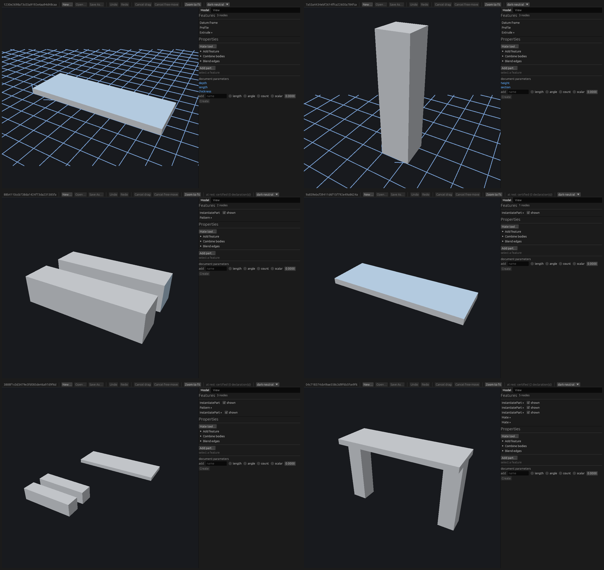
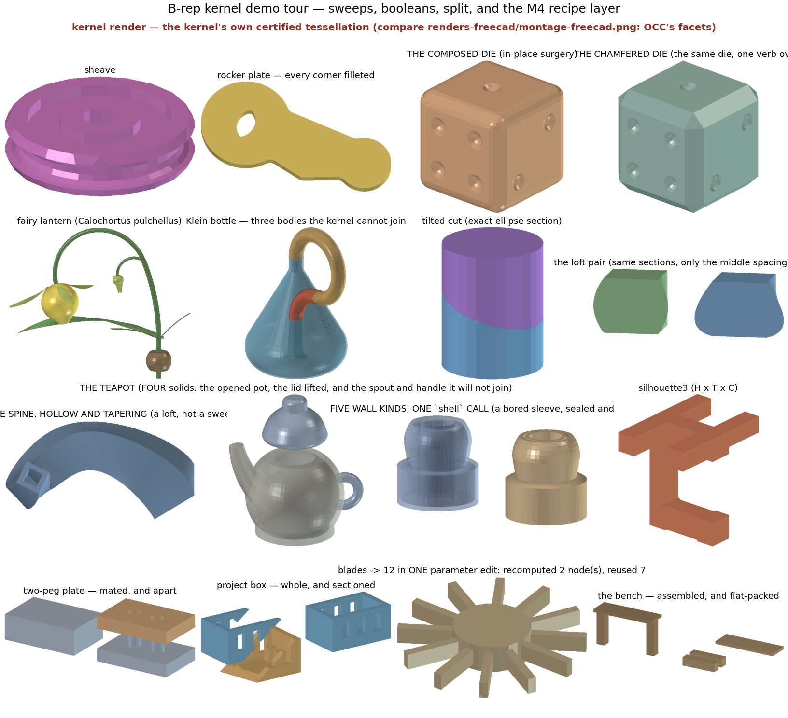

# CAD Kernel (name pending)

A B-rep solid-modeling kernel in Rust: author exact solids, ask them
questions, and export them as STEP or STL. There is a GUI to model in, and a
library — Rust or Python — underneath it. The library is the product and the
GUI is a thin client over it: every operation the GUI performs is itself API,
callable from your own program with no renderer present.

The kernel **refuses rather than guesses**. When two faces coincide and you
have not said they coincide, when a fillet has no corner to sit in, when a
profile crosses itself — it returns a typed error naming what it would have
had to assume, instead of quietly producing something plausible.

Nothing is published to crates.io or PyPI yet, so build from source. The
project name is still pending; `pncad` appears throughout as a deliberately
greppable placeholder for it.

## The GUI

```console
$ cargo run -p viewer --features app                       # an empty document
$ cargo run -p viewer --features app -- document.pncad     # open one
```



Add datums and profiles, extrude and revolve them, boolean and split bodies,
blend a set of edges, pattern and transform; hang the whole part off document
parameters and watch it recompute when you edit one. Assemblies are a
workspace of pinned part documents, instances of them, and mates solved
between them, with a gate that says the result really meets at rest.

Passing a document on the command line is also how you open one on a system
with no file-chooser backend installed — the `Open…` dialog needs one, the
argument does not. Mouse bindings, that backend and the font prerequisites on
Linux and WSL, and how to drive the app headless are in
[`crates/viewer/README.md`](crates/viewer/README.md).

## The demos

The tour builds every example model through the public API, narrates what it
did — operations used, topology census and genus, validation tiers passed,
exact-vs-meshed mass properties — and exports each one as binary STL and
AP214 STEP:

```console
$ cd demos/tour
$ cargo run --release -- ../out                  # build, narrate, export
$ cargo run --release -- gallery ../out/gallery  # the same scenes as .pncad documents
```



The gallery writes `.pncad` files the GUI opens, so it is also the quickest
way to get something real on screen. The pictures above are rendered and
committed by CI rather than built locally;
[`demos/README.md`](demos/README.md) is that lane, and
[`docs/guide/examples.md`](docs/guide/examples.md) maps every demo to what it
demonstrates.

## Using it as a library

**[`docs/GUIDE.md`](docs/GUIDE.md)** is the guide: a quickstart for Rust and
for Python, then the canonical journey — author, validate, measure,
tessellate, cross-check, export — worked in both languages.

- [`docs/guide/fail-loud.md`](docs/guide/fail-loud.md) — the refusals: what
  they look like, and how to read one.
- [`docs/guide/selecting.md`](docs/guide/selecting.md) — naming and selecting
  entities, so a later step can refer to a face or an edge.
- [`docs/guide/meshing.md`](docs/guide/meshing.md) — tessellation, the
  cross-check against the exact measure, and STL.
- [`docs/guide/assembly.md`](docs/guide/assembly.md) — workspaces, instances,
  mates, and the at-rest gate.

From Rust, depend on the façade crate `pncad` and nothing else: it re-exports
every kernel crate as a module and offers a curated prelude, including the
payload types inside error enums. The Python package is the same kernel
through PyO3 — see
[`crates/pncad-py/README.md`](crates/pncad-py/README.md).

The design contract — decisions, layering, and the open questions, the naming
one among them — is [`docs/DESIGN.md`](docs/DESIGN.md).

## Working on the kernel

```console
$ cargo build                                  # the kernel and the pncad façade
$ cargo test --doc -p pncad                    # runs every Rust block in the guide
$ ./crates/pncad-py/run-python-tests.sh        # build and exercise the bindings
$ ./scripts/doc-gate.sh                        # the rustdoc gate (all 8 cargo roots, minutes)
```

Check documentation with that gate rather than with a bare `cargo doc`. It
documents every cargo root at `--all-features` — with one standing exception
its header names and argues, `interval-transcendentals` at default features,
and a second under `--skip-viewer-toolkit`, which puts `viewer` at default
features too — and then re-reads every root that has a
`#[cfg(not(feature = …))]` half at `--no-default-features`. Three passes over
eight roots is a minutes-long run rather than a seconds-long one, which is why
it is what nightly CI and `local-scripts/ci-local.sh` run and not something for
a tight edit loop.

A plain `cargo doc -D warnings` runs default features instead, and there prose
that links to a feature-gated item cannot resolve, so rustdoc reports correct
links as broken. `SweepStrategy::Idealized` in `topo`'s boolean prose is the
live case: over this workspace's public items at default features there are 22
such sites, in `geom-core`, `editor-core` and `topo`, read 2026-09-04. You will
see fewer than that in one invocation, because cargo stops scheduling after the
first unit fails; `--keep-going` shows them all. A red there is usually your
feature selection, not the tree. (The gate's header carries its own count of
the same prose, under its own selection — which adds `--document-private-items`
and so is the larger number. Two populations, not two copies of one.)

The header also carries the whole argument, including the one blind spot the
gate accepts rather than closes: a broken link written *inside* a
`#[cfg(not(feature = …))]` half is reported by nothing, on any tier.

## License

Licensed under either of

- Apache License, Version 2.0 ([LICENSE-APACHE](LICENSE-APACHE) or
  <http://www.apache.org/licenses/LICENSE-2.0>)
- MIT license ([LICENSE-MIT](LICENSE-MIT) or
  <http://opensource.org/licenses/MIT>)

at your option.

### Contribution

Unless you explicitly state otherwise, any contribution intentionally
submitted for inclusion in the work by you, as defined in the Apache-2.0
license, shall be dual licensed as above, without any additional terms or
conditions.
